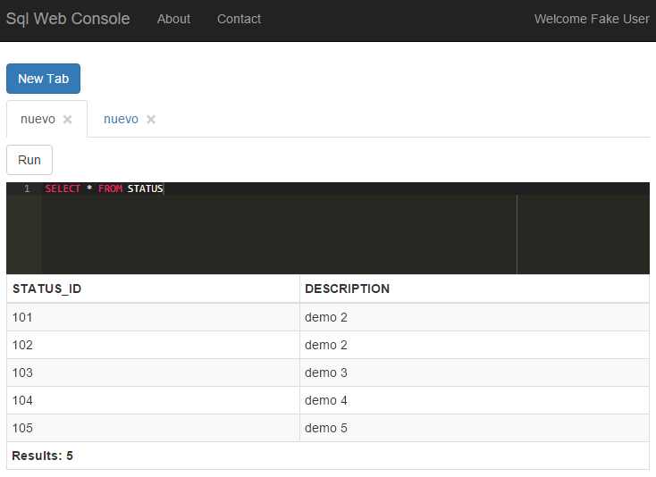

# Sql Web Console

Una consola simple para ejecutar comandos de SQL.

## Autenticación

Posee un mecanismo sencillo de autenticación basado en Active Directory.

## Conexión con múltiples providers

Se pueden configurar cadenas de conexión de cualquier proveedor de conexión que esté registrado en el .Net Framework o en la aplicación.

## Resaltado de sintaxis

Utiliza el editor [ACE](https://ace.c9.io/) por lo que resalta la sintaxis de SQL y despliega los resultados como una tabla.

